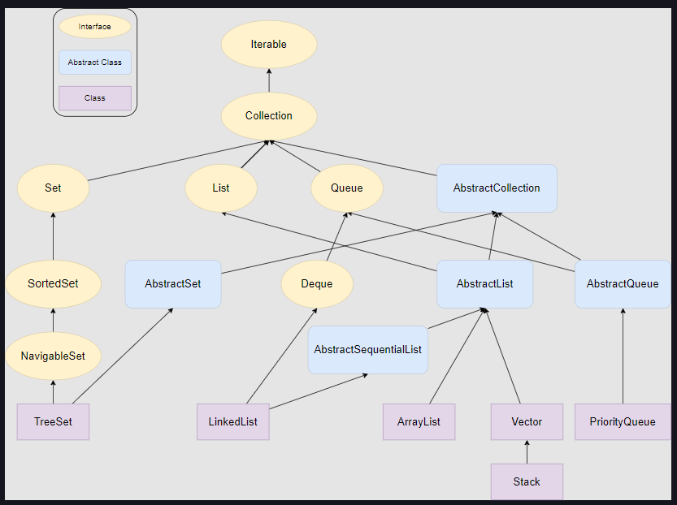

# Collections Framework

**Reference:** Educative.io Java for Programmers

## Introduction

A collection is an object that groups multiple elements of same type into a single unit.

Java collections Framework contains the interfaces, their implementations, and algorithms to process the data stored in a collection.

In Java, we have a Collection interface extended by other interfaces such as List, Set, and Queue. Apart from the Collection interface, we have a Map interface. The Map does not implement the Collection interface because it stores key-value pairs, and the classes that come under the Collection interface store only values.

## Difference between Collection and Collections

- A **Collection** is an interface, whereas **Collections** is a class.
- A **Collection** interface provides the standard functionality of a data structure to **List**, **Set** and **Queue**. Whereas, the **Collections** class provides the utility methods that can be used to search, sort and synchronize collection elements.
