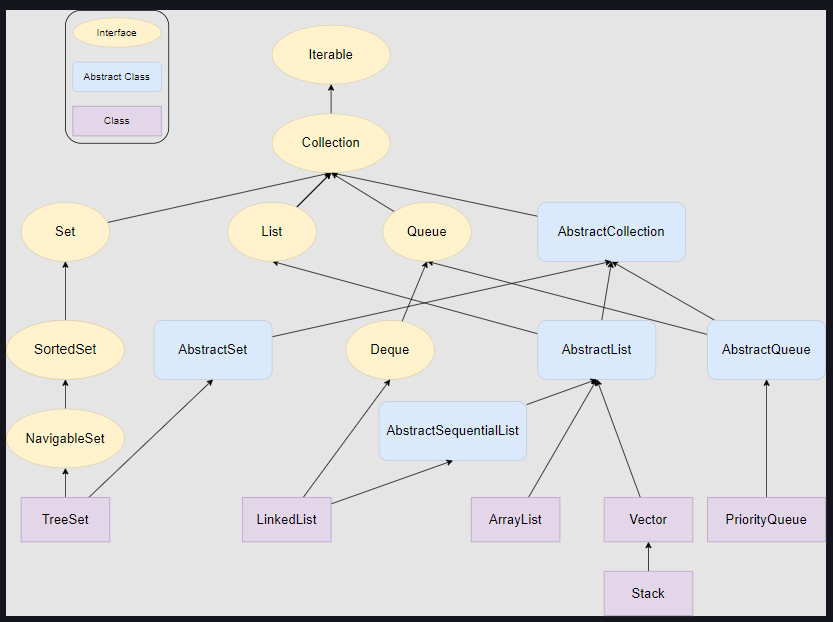

# Collections Framework

**Reference:** Educative.io Java for Programmers

## Introduction

A collection is an object that groups multiple elements of same type into a single unit.

Java collections Framework contains the interfaces, their implementations, and algorithms to process the data stored in a collection.

In Java, we have a Collection interface extended by other interfaces such as List, Set, and Queue. Apart from the Collection interface, we have a Map interface. The Map does not implement the Collection interface because it stores key-value pairs, and the classes that come under the Collection interface store only values.

## Difference between Collection and Collections

- A **Collection** is an interface, whereas **Collections** is a class.
- A **Collection** interface provides the standard functionality of a data structure to **List**, **Set** and **Queue**. Whereas, the **Collections** class provides the utility methods that can be used to search, sort and synchronize collection elements.

In this section, we are mainly going to look at four types of Collections:

1. **Queue**: 
    - PriorityQueue: MinHeap
    - ArrayDeque: Resizeable Array based Deque
    - LinkedList: Implements both List and Deque
2. **List**:
    - ArrayList: Resizeable Array based List with random access
    - LinkedList: LinkedList based list with sequential access
3. **Map**:
    - HashMap: Stores <Key, Value> pairs with no order
    - LinkedHashMap: Maintains insertion order or access order
    - TreeMap: Maintains sorted order by Keys, internally uses RedBlack trees with O(logn) operations
4. **Set**:
    - HashSet: Stores unique elements using a HashMap
    - LinkedHashSet: Uses LinkedHashMap for storing unique elements and maintains the insertion order
    - TreeSet: Uses TreeMap and maintains the sorted order
