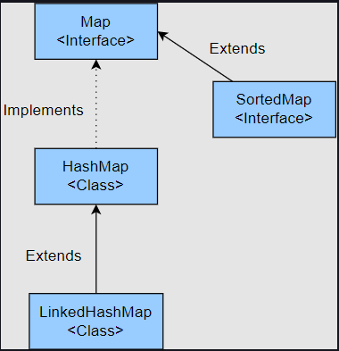
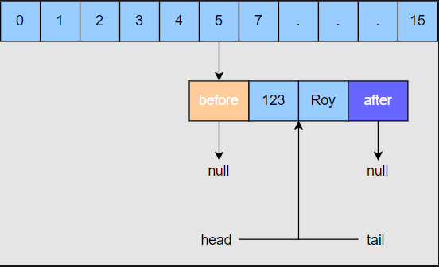
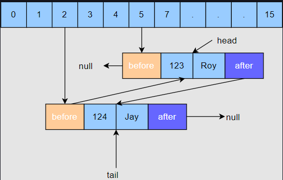
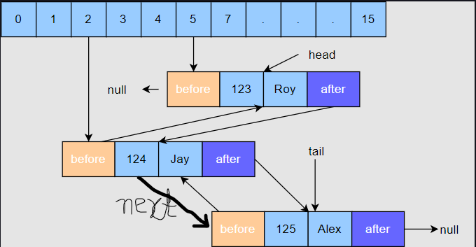

# LinkedHashMap

## Introduction

A Hashmap doesn't maintains insertion order and is not in sorted order.

A TreeMap keeps the elements in sorted order.

Do we have a Map Collection that maintains Insertion Order of the key,value pairs?

LinkedHashMap

The LinkedHashMap Class is just like HashMap with an additional feature of maintaining an order of elements inserted into it. HashMap provided the advantage of quick insertion, search, and deletion but it never maintained the track and order of insertion, which the LinkedHashMap provides where the elements can be accessed in their insertion order.

Features of LinkedHashMap:

- It may have one null key and multiple null values.
- It is non-synchronized.



## Creating a LinkedHashMap

- Using a no-arg constructor: The no-arg constructor, **LinkedHashMap()**, creates a Map with a default capacity of 16 and a default load factor of 0.75. The elements are stored in the insertion order.

- Using the constructor that takes **access order flag**:
  **LinkedHashMap(int capacity, float loadFactor, boolean accessOrder)**

  If the accessOrder is false, the elements will be stored in the order of insertion. If it is true, then the elements are stored in order of access. It means that the element that is accessed most recently is kept last.

## Inserting into a LinkedHashMap

- **put(Key K, Value V)**

Syntax and Code: **LinkedHashMapExample.java**

---

## Internal Working of LinkedHashMap

In LinkedHashMap, each Entry maintains the record of the Entry that was inserted before it and after it.

If we look at the Entry class of LinkedHashMap, then we can see that it has two extra fields in comparison to the Entry class of HashMap. **before** and **after**.

```
static class Entry<K,V> extends HashMap.Node<K,V> {
    Entry<K,V> before, after;
    Entry(int hash, K key, V value, Node<K,V> next) {
        super(hash, key, value, next);
        }
    }
```

There are two additional fields in the LinkedHashMap namely **head** and **tail**. The head points to the first node that was inserted in the Map and tail points to the last node that was inserted in the Map.

**Basically, a doubly linked list is maintained that keeps track of the insertion order of the elements.**

## Inserting the first Element:

Let’s consider creating a LinkedHashMap that stores the student information. The key is the id of the student and the value is the name of the student.

We are inserting our first record, 123; “Roy” in LinkedHashMap on the tail. The following process will occur:

1. The hash of 123 will be calculated and based on the hash value, a bucket will be decided. Let’s say the bucket is 5.
2. An Entry object is created with the key as 123 and the value as Roy. The before and after fields are set to null as this is the first record.
3. Since there is no element in the LinkedHashMap, both the head and tail variables are null. Now both these variables will point towards the newly created Entry.



## Inserting the sceond element

Now we will insert the second record, 124; “Jay”, in the LinkedHashMap on the tail. The following process will happen:

1. The hash of 124 will be calculated and based on the hash value, a bucket will be decided. Let’s say the bucket is 2.
2. An Entry object is created with the key as 124 and the value as Jay. The before field is set to the previous Entry, and the after field is set to null.
3. The tail will now point to this entry, and the head will remain unchanged.



## Inserting the third element

Now we will insert the third record, 125; “Alex”, in the LinkedHashMap on the tail. The following process will happen:

The hash of 125 will be calculated and based on the hash value, a bucket will be decided. Let’s say the bucket is 2 again.

1. An Entry object is created with the key as 125 and the value as Alex. The before field is set to the previous Entry, and the after field is set to null.
2. The tail will now point to this entry, and the head will remain unchanged.


