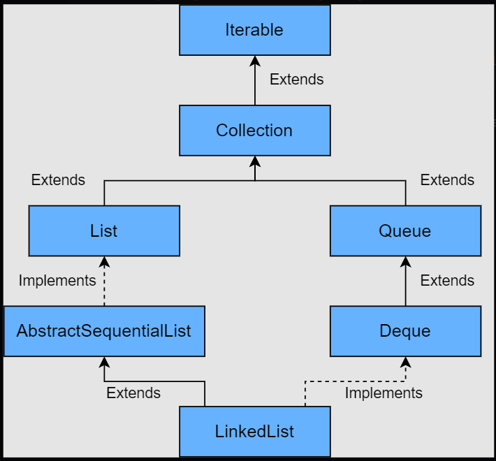

# LinkedList

## Introduction



The LinkedList class in Java implements the List and the Deque interface.

Some of the salient features of a LinkedList are:

- The elements are inserted in the order of insertion.

- It supports duplicate elements.

- We can add any number of null elements.

---

### Internal Implementation of LinkedList

The LinkedList class has a static inner class called **Node.**

Below is the code for the **Node** class:

private static class Node<E> {

         E item;
         Node<E> next;
         Node<E> prev;
         Node(Node<E> prev, E element, Node<E> next) {
            this.item = element;
            this.next = next;
            this.prev = prev;
         }

}

```
In Java, nested classes are of two types:

- Nested non-static class (Inner class)
- Nested static class

Only nested classes can be static. We cannot have static top-level classes.

Like regular classes, static nested classes can include both static and non-static fields and methods.
But static nested classes can only access the class members (static fields and static methods) of the outer class.

To access the static nested class, we don’t need objects of the outer class.

For Example:

class Animal {

// inner class
   class Reptile {
      public void displayInfo() {
        System.out.println("I am a reptile.");
      }
   }

// static class
   static class Mammal {
      public void displayInfo() {
        System.out.println("I am a mammal.");
      }
   }
}

class Main {
   public static void main(String[] args) {
      // object creation of the outer class
      Animal animal = new Animal();

      // object creation of the non-static class
      Animal.Reptile reptile = animal.new Reptile();
      reptile.displayInfo();

      // object creation of the static nested class
      Animal.Mammal mammal = new Animal.Mammal();
      mammal.displayInfo();

   }
}


Note: For Object creation of nested non-static class, we need an instance of the outer class.

```

---

## Creating a Linked List:

- **List< Integer > list = new LinkedList< Integer >();**
- A LinkedList can also be created using an existing Collection.

  **List< Integer > list = new LinkedList< Integer >(oldList);**

---

## Inserting an Element into a LinkedList

- Inserting a single element at the end: **add(E e)** or **addLast(E e)**
- Inserting a single element at the beginning: **addFirst(E e)**
- Inserting an Element at a particular index: **add(int index, E e)**
- Inserting multiple Elements from another Collection: **addAll(Collection c)**
- Inserting multiple Elements from another Collection at a particular index: **addAll(int index, Collection c)**

---

## Fetching Element from LinkedList

- Fetching the first element: **getFirst()**
- Fetching the last element: **getLast()**
- Fetching an element at a particular index: **get(int index)**

---

## Removing element from a LinkedList

- Removing the first element: **removeFirst()**
- Removing the last element: **removeLast()**
- Removing an element at a particular index: **remove(int index)**
- Removing a particular element: **remove(Object o)**

  If there is more than one occurrence of a particular element, then the first occurrence is removed.

---

## Sorting a LinkedList

- Using Collections.sort()
- Using list.sort()

---

Code: **LinkedListUsage.java**
