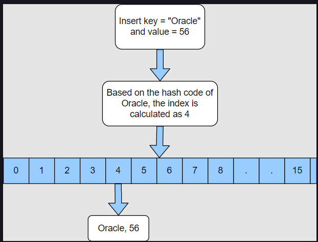
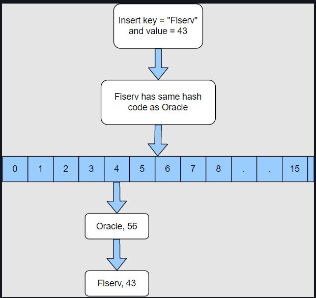

# HashMap

## Introduction

HashMap extends AbstractMap class which inturn implements the Map interface. It is used to store the key-value pairs.

- The keys should be unique.
- HashMap allows only one null key.
- The values can be null or duplicate.
- The keys are stored in random order.

## Creating a HashMap

- Using no-arg constructor

```
Map<String, Integer> map = new HashMap<>();
```

This constructor creates a HashMap with an initial capacity of 16 and load factor of 0.75.

```
Load factor is a number that defines when a Map should be resized. If the load factor is 0.75, then it means that the Map should be resized when it is 75 percent full.
```

We can also provide initial capacity with the load factor while creating the HashMap. If we don’t want frequent resizing then we can set the load factor to a higher number.

## Inserting into a HashMap

We can insert a key-value pair in a HashMap using following methods:

- **put(K key, V value)** method: If the key is not present, then a new key-value pair will be added. If the key is already present, then the value will be updated.

- **putIfAbsent(K key, V value)** method inserts a key-value pair only if it is not already present in the Map. If the key is already present then its value will not be updated.

- **putAll(Map<? extends K, ? extends V> m)** method copies all of the mappings from the specified map to this map.

## Fetching an Element

- **get(Object key)** method takes a key as a parameter and returns the value corresponding to that key. If the key is not present, it returns null.

- **getOrDefault(Object key, V defaultValue)** method is useful if you are not sure whether a key is present in the Map or not. If the key is present then this method returns the value corresponding to the key and if the key is not present then the default value is returned.

## Updating an Element

When we insert a key-value pair in HashMap using put **(Key K, Value V)** and the key is already present then its value gets updated. But if we only want to update the value of a key that is present in the Map, then we can use the **replace()** method.

- **replace(K key, V value):** It replaces the value of the key with the new value and returns the old value. If the key is not present, then it returns null.

- **replace(K key, V oldValue, V newValue):** It checks if the current value of the key is equal to the **_oldValue_** provided in the parameter, if yes then it replaces the value with newValue and returns true; otherwise, it returns false.

- **replaceAll(BiFunction<? super K, ? super V, ? extends V> function):** This method takes a BiFunction as input and replaces the values of all the keys with the result of the given function.

  ```
  hashMap.replaceAll((k,v) -> v + 10);
  ```

## Removing an Element from a HashMap

- **remove(Object key):** method takes _key_ as a parameter and removes the correcponding _key, value_ pair from the map. This method returns the _value_ of the key that was removed. If the _key_ is not present, then it returns null.

- **remove(Object key, Object value):** This method removes the _key, value_ pair only if the mentioned _key, value_ pair is present in the map. This method returns true if the key is removed; otherwise, it returns false.

## Checking if a Key is present in HashMap

- **containsKey(Object key)** method to check if a given key is present in the HashMap. This method returns true if the key is present and returns false if the key is not present.

- **containsValue(Object value)**: method that returns true if one or more keys are mapped to this value

## Fetching all the Keys from the HashMap

- **keySet()**: This method returns a Set containing all the keys present in the Map.

## Fetching all the values present in a HashMap

- **values()** method returns a Collection containing all the values present in the Map

## Checking if a HashMap has no key value pairs

- **isEmpty()** method returns true if the Map does not have any _key, value_ pairs and returns false if the Map has some elements.

## HashMap Internal Implementation

The basic principle used by a HashMap to store elements is Hashing. Hashing is a way to assign a unique code for any variable or object after applying any formula to its properties. The unique code is called HashCode.

**Hashing is a one-way function**

Some of the properties of HashCode are:

1. If two objects are equal, then they should have the same hashcode.
2. If two objects have the same hashcode, then it is not necessary for them to be equal.

## Nested Static **_Node_** class

HashMap has a nested static class called Node as shown below.

```
static class Node<K,V> implements Map.Entry<K,V> {
        final int hash;
        final K key;
        V value;
        Node<K,V> next;
...some more code
```

This class has a key and a value field. It also has a next field that is used to point to the next Node similar to LinkedList nested static Node class.

## Creating a HashMap

HashMap maintains an array of Node objects called _table_.

```
transient Node<K,V>[] table;
```

On creating a HashMap, this array of Node Objects is not initialized untill an element is inserted

When we create a HashMap using the no-arg constructor, then the only thing that happens is that the loadFactor is assigned DEFAULT_LOAD_FACTOR, which is .75

## Inserting into a HashMap

When an element is inserted into the Hashmap for the first time, the array _table_ is initialized with size 16. So now there are 16 buckets from index 0 to 15.

If the key that we are inserting is null, then it is inserted at index 0 because the hashcode of null is 0. If the key is not null, then the hash of the key is calculated using a **_Hashing Function_**, and based on the hash value the bucket is decided.

If there is no other element in that bucket, then a new Node is created, and it is inserted in that bucket.



### Insertion in case of Collision

Now, let’s say we insert another key that has the same hashcode as the previous key. In this case, this key will go to the same bucket and see that there is already an element there. This is referred to as collision.

In case of collision, it checks if the existing key in the bucket is equal to the key that we are trying to store. If yes, then the value of the key is updated. If the key is different, then it is added at the end of the existing key in the bucket to form a LinkedList.



### Improvement in HashMap from Java 8

There is one improvement made in Java 8. If the size of the LinkedList in a particular bucket becomes more than TREEIFY_THRESHOLD, then the LinkedList is converted to a red-black tree. TREEIFY_THRESHOLD is a constant with a default value of 8. This value can’t be changed as it is a final variable. This means that if the size of the Linked List becomes more than 8, then it is converted into a tree.

## Fetching a value from a HashMap

When we need to get a value from HashMap, then the hashcode of the key is calculated using **\*Hashing Function**. Based on the hashcode the bucket is decided, and we go to that bucket. Now it is possible that there are zero or more keys stored at that bucket. We match our key with all the keys in that bucket using the equals() method. If the match is found, then we return the value of that key. If the key is not found, then null is returned.

## Resizing a HashMap

We already know that a HashMap is resized when it is about to get full. When a HashMap will be resized depends upon the load factor. If the current capacity is 16, and the load factor is 0.75, then the HashMap will be resized when it has 12 elements (16 \* 0.75).

When a HashMap is resized, its capacity is always doubled. So if the current capacity is 16, then the new capacity will be 32. Now all the elements that are stored in the HashMap will be rearranged amongst these 32 buckets. This is a time-consuming operation as the bucket for each key is calculated and rearranged.

## Custom Key Class

How to design a class whose Objects can be used as Keys in a HashMap?

The class that is being used as a key must override both **equals()** and **hashcode()** methods and should follow the hashcode() and equals() contract. The contract says:

- If two objects are equal, then they must have the same hash code.
- If two objects have the same hash code, they may or may not be equal.

Example of a Class whose objects can be used as Keys:

```
class Employee {

	int empId;
	String empName;

	public Employee(int empId, String empName) {
		super();
		this.empId = empId;
		this.empName = empName;
	}

	@Override
	public int hashCode() {
		final int prime = 31;
		int result = 1;
		result = prime * result + empId;
		result = prime * result + ((empName == null) ? 0 : empName.hashCode());
		return result;
	}

	@Override
	public boolean equals(Object obj) {
		Employee emp = (Employee) obj;
		return this.empId == emp.empId;
	}

}
```

When the above class objects are used as keys, a problem can arise in following scenario:

```
	public static void main(String args[]) {

		Employee emp1 = new Employee(123, "Jane");

		Map<Employee, Integer> employeeMap = new HashMap<>();

		employeeMap.put(emp1, 56000);

		emp1.empName = "Alex";

		System.out.println(employeeMap.get(emp1));

	}
```

When we run the above program, null is returned. The reason is when we change the Employee object its hashcode also changes.

**That is why it is preferred that if we are using a custom object as the HashMap key, then either the class should be immutable, or the fields that are used to calculate the hashcode should be made final.**

## HashMap Iteration

In a map, each key-value pair is called **Entry**. The **entrySet()** method returns the Set of Entry objects i.e. _key, value_ pairs in that map . We can iterate over this Set using any of the below approaches:

**Note:** The Entry class contains two methods: **getKey()** and **getValue()**, which can be used to get the key and value respectively.

- Using a for loop

```
	public static void main(String args[]) {

		Map<String, Integer> stockPrice = new HashMap<>();

		stockPrice.put("Oracle", 56);
		stockPrice.put("Fiserv", 117);
		stockPrice.put("BMW", 73);
		stockPrice.put("Microsoft", 213);

		Set<Entry<String, Integer>> entrySet = stockPrice.entrySet(); // Returns a Set of Entries

		for (Entry<String, Integer> entry : entrySet) {
			System.out.println("Company Name: " + entry.getKey() + " Stock Price: " + entry.getValue());
		}
	}
```

- Using an Iterator: We can get the iterator on the EntrySet and then use it to iterate the HashMap.

**Note:** If we remove an element from the EntrySet, then it is also removed from the original Map.

```
	public static void main(String args[]) {

		Map<String, Integer> stockPrice = new HashMap<>();

		stockPrice.put("Oracle", 56);
		stockPrice.put("Fiserv", 117);
		stockPrice.put("BMW", 73);
		stockPrice.put("Microsoft", 213);

		Set<Entry<String, Integer>> entrySet = stockPrice.entrySet(); // Returns a Set of Entries

		Iterator<Entry<String, Integer>> itr = entrySet.iterator(); //Getting the iterator

		while (itr.hasNext()) {
			Entry<String,Integer> entry = itr.next();
			System.out.println("Company Name: " + entry.getKey() + " Stock Price: " + entry.getValue());

			if(entry.getKey().equals("Oracle")) {
				itr.remove(); // removes the entry from the actual stockPrice hashMap as well.
			}
		}
		System.out.println(stockPrice);
	}
```

- Using forEach method

```
	public static void main(String args[]) {

		Map<String, Integer> stockPrice = new HashMap<>();

		stockPrice.put("Oracle", 56);
		stockPrice.put("Fiserv", 117);
		stockPrice.put("BMW", 73);
		stockPrice.put("Microsoft", 213);

		stockPrice.forEach((key, value) -> System.out
				.println("Company Name: " + key + " Stock Price: " + value));

	}
```

**Syntax and Code**: HashMapExercise.java

---

Questions:

Ques) In what order are the elements inserted in a HashMap?

Ans) Random Order

Ques) Can two different keys have the same value in a HashMap?

Ans) Yes

Ques) What is the default load factor in a HashMap?

Ans) 0.75
