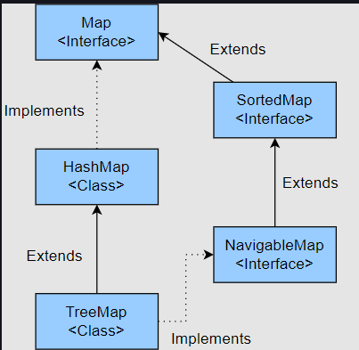

# TreeMap

## Introduction

TreeMap is a Map that **stores the keys in sorted order**. Some of the features of TreeMap are:

- The entries in TreeMap are sorted in the natural ordering of its keys.

- It does not allow null keys, however there can be null values.

- The TreeMap is not thread-safe, although it can be made thread-safe using the synchronizedMap() method of the Collections class.

Since a TreeMap stores the keys in sorted order, the objects that we are storing as keys in the TreeMap should either implement the Comparable interface or we should pass a Comparator while creating the TreeMap object.



## Creating a TreeMap

- Using a no-arg constructor:

```
    TreeMap<String, Integer> reverseMap = new TreeMap<>();
```

The keys that we will store in this TreeMap must implement the Comparable interface.

- Using the constructor with Comparator as an argument:
  If the objects that we are storing in a TreeMap as a key do not implement the Comparable interface or if we need to store the keys in descending order, then we can provide a custom Comparator while creating the TreeMap. Now, when the keys are stored in the TreeMap, they are sorted as per the logic provided by the Comparator.

```
TreeMap<String, Integer> reverseMap = new TreeMap<>(Comparator.reverseOrder());
```

- Using constructor with the argument of type Map:
  A TreeMap can be created from another Map as well. The keys are stored in sorted order irrespective of the order that the elements are stored in the provided Map.

```
// Creating a TreeMap which will store all the elements in reverse order.
		TreeMap<String, Integer> reverseMap = new TreeMap<>(Comparator.reverseOrder());
		reverseMap.put("Oracle", 43);
		reverseMap.put("Microsoft", 56);
		reverseMap.put("Apple", 43);
		reverseMap.put("Novartis", 87);
		System.out.println("Elements are stored in reverse order: " + reverseMap);

		// Creating a HashMap which will store all the elements in random order.
		Map<String, Integer> hashMap = new HashMap<>();
		hashMap.put("Oracle", 43);
		hashMap.put("Microsoft", 56);
		hashMap.put("Apple", 43);
		hashMap.put("Novartis", 87);
		System.out.println("Elements are stored in random order: " + hashMap);

		// Creating a TreeMap using existing HashMap. This will store the elements in ascending order.
		TreeMap<String, Integer> treeMap1 = new TreeMap<>(hashMap);
		System.out.println("Elements are stored in ascending order: " + treeMap1);
```

```
Output:
Elements are stored in reverse order: {Oracle=43, Novartis=87, Microsoft=56, Apple=43}
Elements are stored in random order: {Apple=43, Microsoft=56, Oracle=43, Novartis=87}
Elements are stored in ascending order: {Apple=43, Microsoft=56, Novartis=87, Oracle=43}
```

## Inserting elements in a TreeMap

- **put(K key, V value)**: If the key is not present, then a new key-value pair will be added. If the key is already present, then the value will be updated.

- **putAll(Map<? extends K, ? extends V> m)**: method copies all of the mappings from the specified map to this map. These mappings will replace any mappings that this map had for any of the keys currently in the specified map

## Fetching an Element from a TreeMap

- **Fetching the value for a particular key** : **get(Object o)**: method will return the value of the key if the key is present. If the key is not present, it will return null.

- **Fetching the smallest key**: **firstKey()** If the TreeMap is empty, then **NoSuchElementException** is thrown. If we want to get the smallest entry, then the **firstEntry()** method can be used.

- **Fetching the largest key**: **lastKey()** method. If the TreeMap is empty, then NoSuchElementException is thrown. If we want to get the largest entry, then the lastEntry() method can be used.

## Removing an Element from a TreeMap

- **remove(Object o)** method: This method returns the previous value for this key if the key is present. If the key is not present, then null is returned.

## Updating values in a TreeMap

- **replace method**: If we use **put(K key, V value)** in a TreeMap, and the key is already present, then the corresponding value is updated, otherwise a new key, value pair is inserted. But what if we want to update the value of a key only if it is already present in the Map? In that case, we can use the replace() method provided in the TreeMap.

- **Replacing without checking the previous value**: **replace(Key k, value v)** method is used to replace the value of the given key. If the key is present then this method replaces the old value with the new value and returns the old value. If the key is not present then null is returned.

- **Replacing after checking the previous value**: **replace(K key, V oldValue, V newValue)** method is used to replace the value of the given key if its current value is the same as the provided oldValue. If the value is replaced, then true is returned. If not, then false is returned.

## Sorting a TreeMap by Values:

Ques) Can we have a TreeMap that stores Key, values pairs(Map.Entry) sorted by values instead of keys?

Ans) You can't have the TreeMap itself sort on the values, since that defies the SortedMap specification:

```
A SortedMap provides a total ordering on its keys.
```

The comparator passed to the TreeMap constructor will alwyas take Keys as arguments and never a Map.Entry as argument

However, using an external collection, you can always sort Map.entrySet() however you wish, either by keys, values, or even a combination of the two.

For Example: **SortTreeMapByValue.java**
