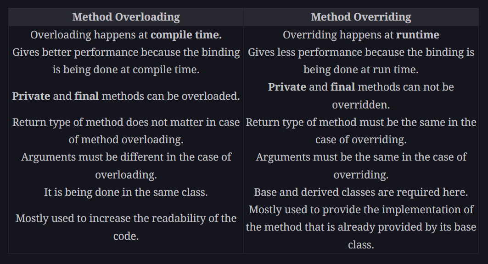
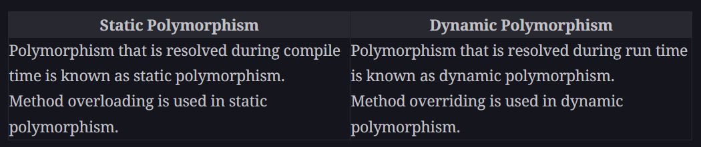
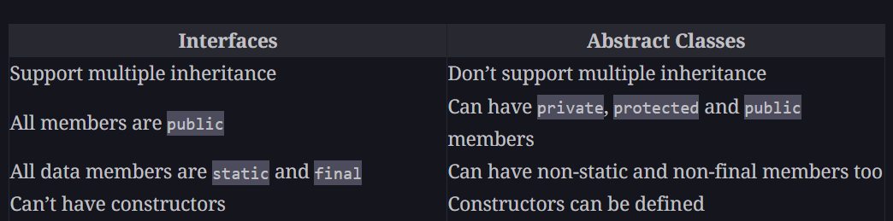

**Inheritance** is used to implement **IS A** relationship

For example: Car **IS A** Vehicle, Square **IS A** Shape

**Syntax**: class subclass **extends** superclass{}

- Java does not supports multiple inheritance. Multiple Inheritance is possible only using Interfaces.
- In Java, all classes by default inherits from **Object** class.

## Class Members Access Control

| Accessible Within / Modifier   | default | private | protected | public |
| ------------------------------ | ------- | ------- | --------- | ------ |
| same class                     | Yes     | Yes     | Yes       | Yes    |
| same package subclass          | Yes     | No      | Yes       | Yes    |
| same package non-subclass      | Yes     | No      | **Yes**   | Yes    |
| different package subclass     | No      | No      | Yes       | Yes    |
| different package non-subclass | No      | No      | No        | Yes    |

**Note**:

- **default**: To restrict class members access to anywhere within same package.
- **private**: To restrict class members access within the same class
- **protected**: To restrict class members access to the subclass of a different package. The protected data members can be accessed anywhere inside a Java package. However, outside the package, they can only be referred to through an inherited class.

---

**Note**: Unlike C++, protected members in Java are accessible within same package non-subclass.

---

## Access modifiers for Non-Nested Classes :

- **default**: Class can only be accessed within the same package
- **public**: Class can be used across packages.

---

**Note**: A Superclass reference variable can point to a Subclass object. This is to support runtime polymorphism.

---

## Super keyword

We use **super** keyword in following two scenarios:

- To call superclass constructor
- To access a member of the superclass that has been hidden by a member of a subclass.

**Note**: To call superclass constructor from subclass constructor **super()** must be the first statement executed in a subclass constructor. If super() is not used then the default(parameterless) constructor of each superclass will be executed.

**Ques: In what order are the constructors executed in an inheritance chain?**

**Ans:** Constructors complete their execution in order of derivation from superclass to subclass.

---

## Method Overriding

If superclass has a method and subclass also defines a method with the **same name** and **same parameters signature**, then the subclass is said to have overridden the superclass method.

So, now whenever a subclass object tries to call overridden method, the subclass version of the method will be called. And whenever a superclass object tries to call that overridden method, the superclass version of that method will be executed

---

**Ques:** Method Overloading vs Method Overriding

## Runtime Polymorphism

Two facts that supports runtime polymorphism:

- a superclass reference variable can also point to a subclass object.
- method overriding

class A{
public void callme(){
System.out.println("A");
}
}

class B extends A{
public void callme(){
System.out.println("B");
}
}

class C extends B{
public void callme(){
System.out.println("C");
}
}

A obj = new A();
obj.callme(); //A

obj = new B();
obj.callme(); //B

obj = new C();
obj.callme(); //C

**Runtime Polymorphism**: A call to an overridden method is resolved at runtime.

**It is the type of the object being referred to (not the type of the reference variable) that determines which version of an overridden method will be executed**

---

**Ques:** Difference between Static and Dynamic Polymorphism

---

## Abstract methods and Abstract classes

**Abstract method:** Method that doesnot have any implementation and must be implemented by the subclass.

- An abstract method can never be private, as it has to be implemented in subclass.

**Abstract Class**: Class that has one or more abstract methods.

- An abstract class can have constructors.
- An abstract class can also have instance variables, static methods/variables.
- Abstract class cannot be instantiated.

Please check Abstract.java code for syntax details.

---

## final keyword

As discussed before, the final keyword can be used for following cases:

Case 1) **final** prevents the contents of a variable from being modified.

We can initialize **final** variables in just exactly two ways:

1. At the time of declaration
2. We can assign it a value within a constructor.

In addition to class variables, both method parameters and local variables can be declared **final**. Declaring a method parameter **final** prevents it from being changed within the method. Declaring a local variable **final** within method prevents it from being assigned a value more than once.

Case 2) **final** keyword can be used to prevent Method Overriding

To disallow a method from being overridden specify **final** as a modifier at the start of it's declaration.

class A{

    final void meth(){
        System.out.println("This is a final method");
    }

}

class B extends A {

    void meth(){ //Throws an Error, final methods cannot be overridden
        System.out.println("Throws an error");
    }

}

Case 3) **final** keyword can be used to prevent Inheritance

- To prevent a class from being inherited, precede the class declaration with **final**.
- Declaring a class as final implicitly declares all of it's methods as **final** too

---

## The **Object** Class

**Object** class is the super class of all other classes. This means that a reference variable of type Object can refer to an object of any other class.

Object class defines many methods, which means that they are available in every object. A few common methods out of these are:

- Object clone(): Creates a new Object that is the same as the object being cloned.
- boolean equals(Object object): Determines whether one object is equal to another.
- void finalize(): destructor function, called before an usused object is recycled.
- String toString(): Returns a string that describes the object

---

## Interfaces

- Interfaces can be used to achieve loose coupling in an application. This means that a change in one class doesn’t affect the implementation of the other class.
- Using Interfaces, we specify what all methods a class should implement and not how should it implement.
- A class can implement any number of interfaces.
- To implement an Interface, a class must define all the methods declared in the interface.
- An interface cannot be instantiated.

**Access modifiers for Interfaces:**

- default
- public

---

- **Note:** Inside a .java file there can only one public class or one public interface along with other classes/interfaces. And the name of the file should be same as public class/Interface name.

Because when we import a class we write import pkg1.pkg2.pkg3.classFile , this classFile should resolve to only one class/interface name.

---

## **Ques**: Can an Interface have variables?

**Ans**: Yes, interfaces can have variables, they serve as shared constants and remains same for all the classes that implements interface.

- By default, all variables are final, static. "final" because we don't want classes to modify their values. And "static" because Interfaces cannot have instance variables.

- All methods and variables inside interfaces are implicitly public.

---

## **Note**: All the implementations of Interface methods inside classes must be public.

Because we cannot lower the access scope i.e we cannot reduce the visibility of interface methods in implementation class. As by default, all the variables and methods inside an Interface are public.

This is a general rule to be followed during method overridding. The subclass overriding a superclass method should never lower the access scope of the method as defined in the superclass.

For example, if you try to compile the LowerAccessScope.java file. You will get a compile time error:

"attempting to assign weaker access privileges; was public"

"Cannot reduce the visibility of the inherited method from subclass"

**Ques:** Can overriden methods have a different access modiifier?

**Ans:** Yes, but we cannot lower the access scope.

---

## We can have Object references of type Interfaces.

Example: Please Refer to Stack.java file, wherein we use IStack interface reference Object to call push and pop on objects of two different classes.

---

## Interfaces can be extended

One interface can inherit another using **extends** keyword

interface A {
void meth1();
void meth2();
}

interface B extends A {
void meth3();
}

Now a class implementing interface B will have to provide implementation for all three methods meth1(), meth2(), meth3().

---

## Default Interface Methods

- Prior to JDK 8, an Interface could not define any method's implementation whatsoever.

But to solve the problem of expanding an Interface without breaking any of the existing code, JDK 8 allowed a **default method** implementation.

Recall that a class implementing an interface should provide an implementation for all the methods declared in an interface.

In the past, if a new method was to be added to an interface, then the addition of that method would break the existing code because no implementation would be found for that new method.

The **default method** solves this problem by supplying a default implementation that will be used if no other implementation is explicitly provided. Thus the addition of a new method will not break the existing code.

**Syntax:**

interface IF {

    default String getString(){
        return "This is the default implementation";
    }

}

---

### JDK 8 also allowed interfaces to have static methods.

The static methods in interfaces are similar to default methods but the only difference is that you can’t override them. And the static methods can be called using Interface.

Interface.staticMethod();

---

## Multiple Inheritance Issues

As Java allows multiple inheritance through interfaces, following Issues can comeup:

1. If a class implements two interfaces and if both the interfaces have default methods of same name and the class doesnot override that method, then this will lead to error due to naming conflict while using that method using class instance.method().

2. If we have a hierarchical interface chain i.e interface B extends interface A and we have default methods implementation with same name in both A and B. Then if the class is implementing interface B and does not override default method, then while calling class instance.method(), then the default implementation of interface B will be called.

---

---

## Aggregation vs Composition

While inheritance represents a relationship between classes, there are situations where there are relationships between objects.

The objects of independent classes interact with each other in different ways.

There are three commonly used relationships between classes:

1. IS-A relationship: **Inheritance**
2. Part-Of relationship: **Composition**
3. Has-A relationship: **Aggregation**

### Part-Of relationship (**Composition**)

- The objects of another class are part of owner class.
- The lifetime of another class object is dependent on the lifetime of owner class as owner class holds the object of another class.
- **Tightly Coupled:** As the lifetime of another class object is dependent on the lifetime of owner class

Example: Refer to Composition.java

### Has-a relationship (**Aggregation**)

- Owner class has object reference of another class object.
- Lifetime of another class object is independent of owner class as owner class only has an object reference.

  **Independent Lifetime:** The owner class object could get deleted, but the another class object can continue to exist in the program.

- **Loosely Coupled:** As the another class object lives on even after the owner class object goes out of scope.

Example: Refer to Aggregation.java
